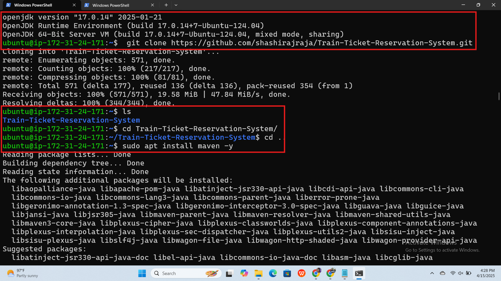
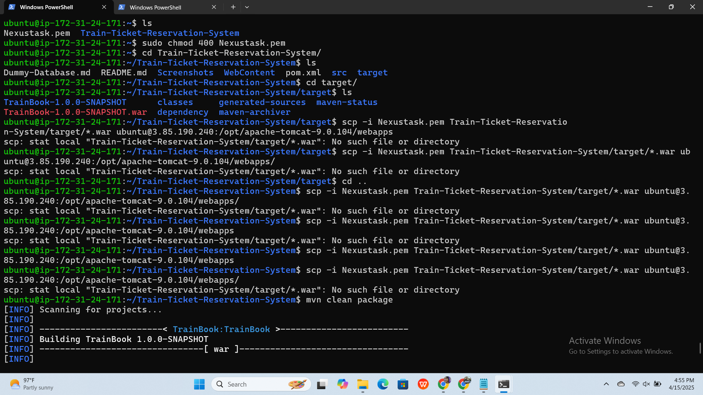

# Train Ticket Reservation System Deployment Guide

## Server One: Java Build and WAR Packaging

### 1. Copy `.pem` File to Server One
```bash
scp -i ./Nexustask.pem ./Nexustask.pem ubuntu@<ServerOne_Public_IP>:~
```

### 2. Install Java and Maven
```bash
sudo apt update
sudo apt install openjdk-17-jdk -y
java -version
sudo apt install maven -y
```

### 3. Clone and Build Project
```bash
# Navigate into your project directory
cd Train-Ticket-Reservation-System/
mvn clean
mvn package
```

### 4. Copy WAR File to Server Two
```bash
# Optional: Check the WAR file exists
cd target/
ls
pwd

# Copy WAR file to Server Two (Tomcat Webapps folder)
scp -i Nexustask.pem Train-Ticket-Reservation-System/target/*.war ubuntu@<ServerTwo_Public_IP>:/home/ubuntu/apache-tomcat-10.1.40/webapps
```

---

## Server Two: Tomcat Setup and WAR Deployment

### 1. Install Java
```bash
sudo apt update
sudo apt install openjdk-17-jdk -y
java -version
```

### 2. Download and Extract Apache Tomcat
```bash
wget https://dlcdn.apache.org/tomcat/tomcat-10/v10.1.40/bin/apache-tomcat-10.1.40.tar.gz
tar -xvf apache-tomcat-10.1.40.tar.gz
cd apache-tomcat-10.1.40/
```

### 3. Start Tomcat
```bash
cd bin/
./startup.sh
```

### 4. Configure Tomcat Manager Access

#### a. Modify `context.xml` Files
```bash
sudo vi ./webapps/host-manager/META-INF/context.xml
sudo vi ./webapps/manager/META-INF/context.xml

# Comment out or remove the IP-based restrictions.
```

#### b. Edit `tomcat-users.xml`
```bash
cd ../../conf/
sudo vi tomcat-users.xml

# Add the following inside <tomcat-users>:
<user username="admin" password="admin" roles="manager-gui,admin-gui"/>
```

### 5. Deploy WAR File
```bash
# WAR file should already be copied from Server One to:
# /home/ubuntu/apache-tomcat-10.1.40/webapps

# You can verify it:
cd /home/ubuntu/apache-tomcat-10.1.40/webapps
ls
```

---

## Notes
- Ensure port **8080** is open in your firewall or cloud security group to access Tomcat.
- Access Tomcat via: `http://<ServerTwo_Public_IP>:8080`








