# 📦 Nexus Repository Manager Installation Guide

This guide walks you through setting up **Nexus Repository Manager** on a Linux server (Ubuntu).

> ✅ **Note**: Make sure to **open port 8081** in your cloud security group or firewall settings **before** accessing the Nexus UI in a browser.

---

## 🧰 1. Initial System Setup

```bash
sudo apt update
sudo vi /etc/hostname
sudo init 6  # Reboot the system
```

---

## 🔧 2. Install Java (OpenJDK 11)

```bash
sudo apt update
sudo apt upgrade -y
sudo apt install openjdk-11-jdk -y
java -version
```

---

## 📥 3. Download and Extract Nexus

```bash
wget https://download.sonatype.com/nexus/3/nexus-unix-x86-64-3.79.0-09.tar.gz
ls
tar -xvzf nexus-unix-x86-64-3.79.0-09.tar.gz
ls
```

---

## 📁 4. Move Nexus to Installation Directory

```bash
sudo mv nexus-3.79.0-09 /opt/nexus
sudo mv sonatype-work /opt/
cd /opt/
ls
```

---

## 👤 5. Create Nexus User and Set Permissions

```bash
cd ..
sudo adduser nexus
sudo chown -R nexus:nexus /opt/nexus
sudo chown -R nexus:nexus /opt/sonatype-work
```

---

## ⚙️ 6. Create a Systemd Service File

```bash
sudo vi /etc/systemd/system/nexus.service
```

Paste the following content into the file:

```ini
[Unit]
Description=nexus service
After=network.target

[Service]
Type=forking
LimitNOFILE=65536
ExecStart=/opt/nexus/bin/nexus start
ExecStop=/opt/nexus/bin/nexus stop
User=nexus
Restart=on-abort

[Install]
WantedBy=multi-user.target
```

---

## 🚀 7. Enable and Start Nexus

```bash
sudo systemctl enable nexus
sudo systemctl start nexus
sudo systemctl status nexus
```

---

## 🔑 8. Get Initial Admin Password

```bash
cat /opt/sonatype-work/nexus3/admin.password
```

Use the password to log in at:

```
http://<your-server-ip>:8081
```

- **Username**: admin
- **Password**: (from the command above)

---

## ✅ Notes

- Do not run Nexus as root.
- Ensure port `8081` is open in the firewall.
- You can configure Nexus to run on a different port by modifying the `nexus-default.properties` file in `/opt/nexus/etc`.


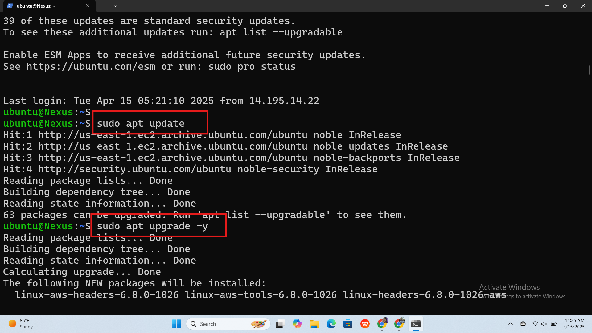
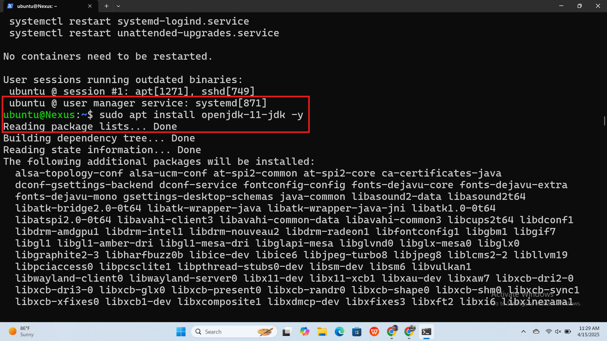
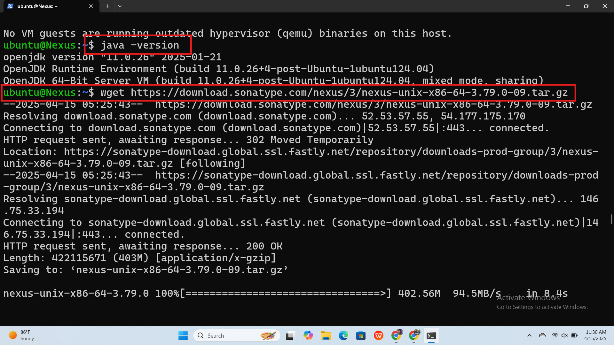
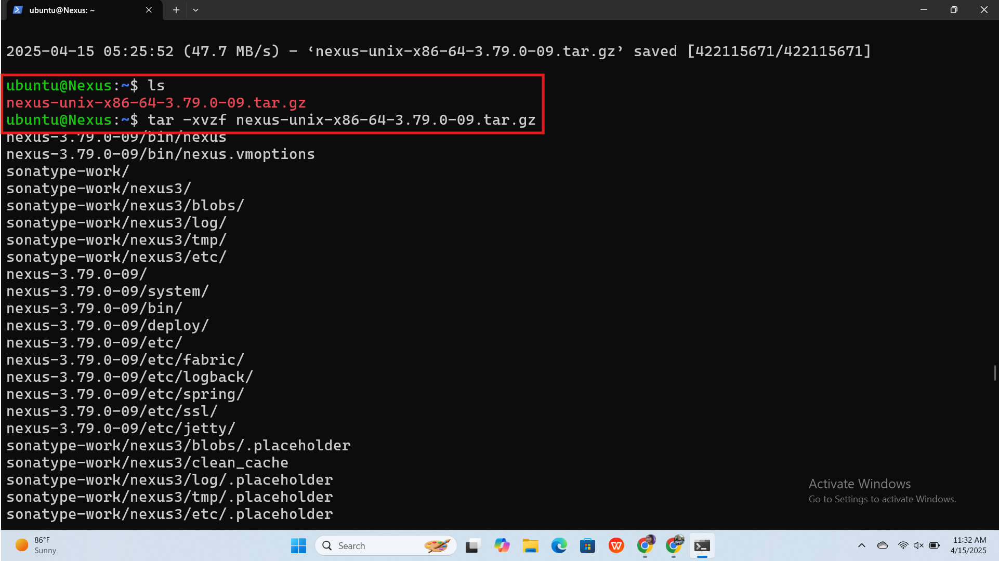
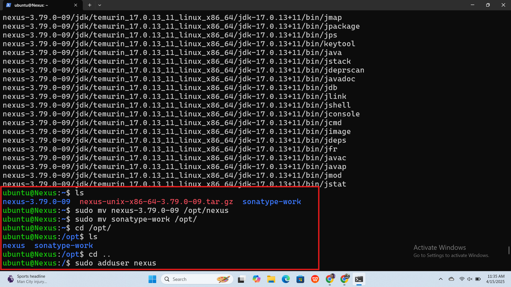
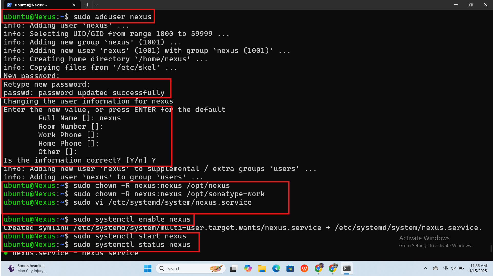
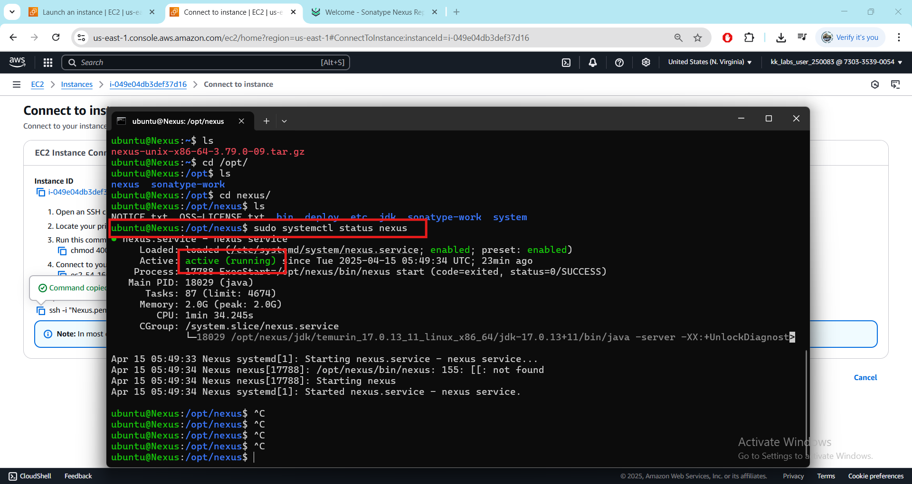
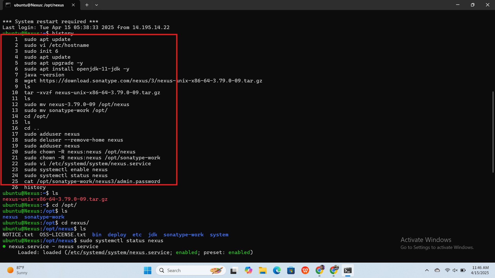
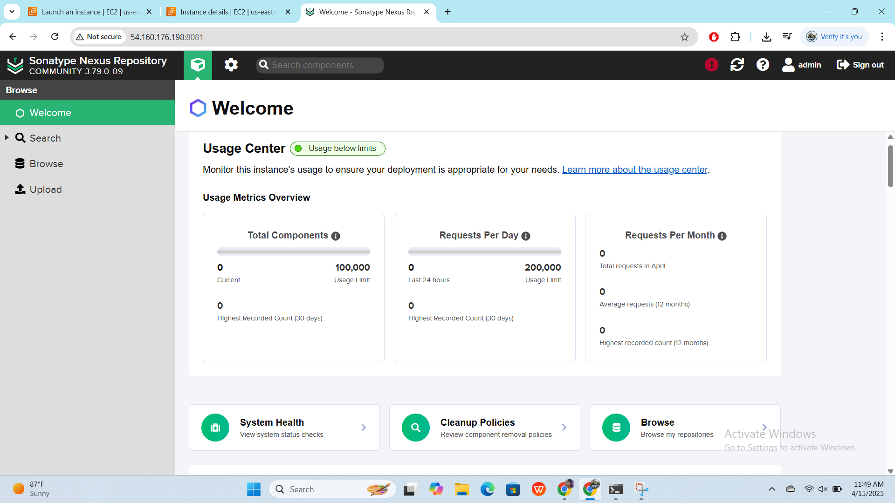
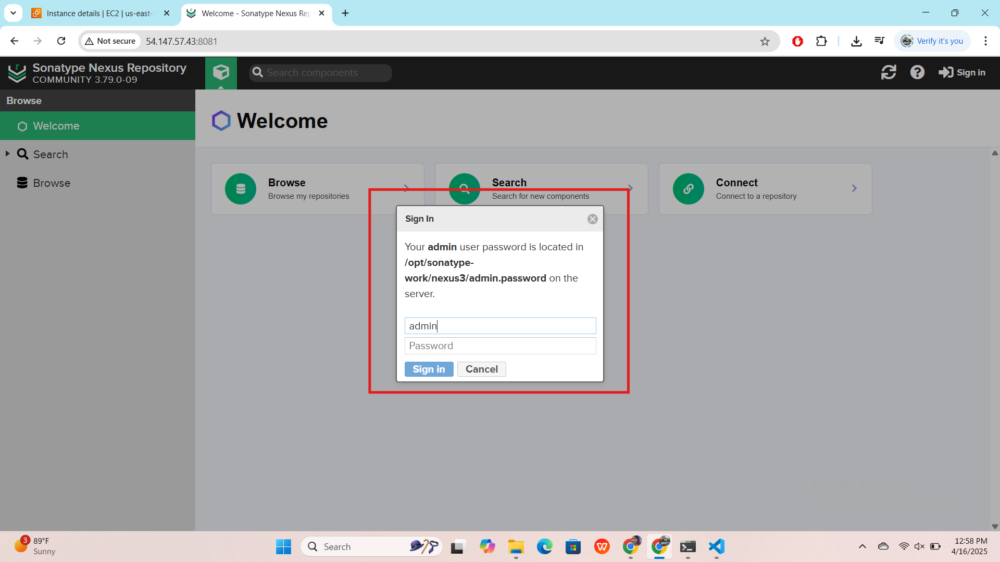
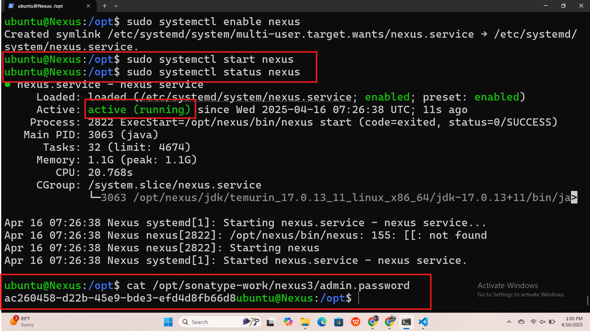
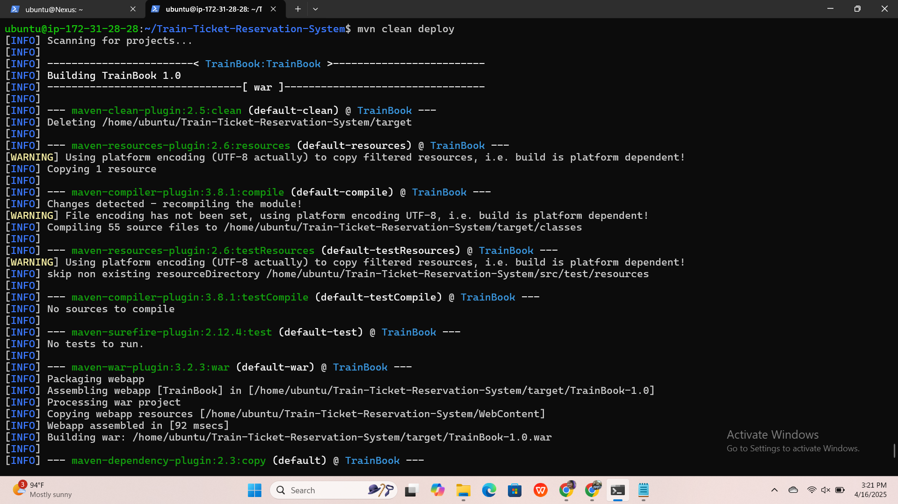
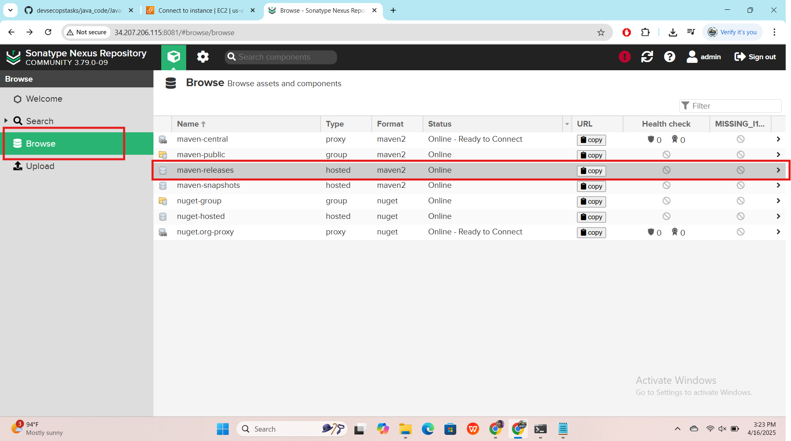
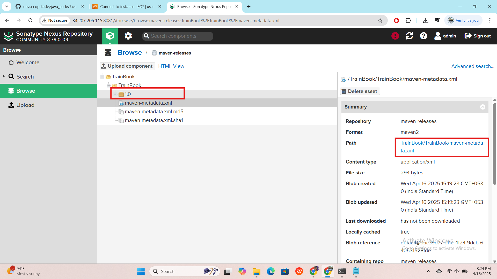


