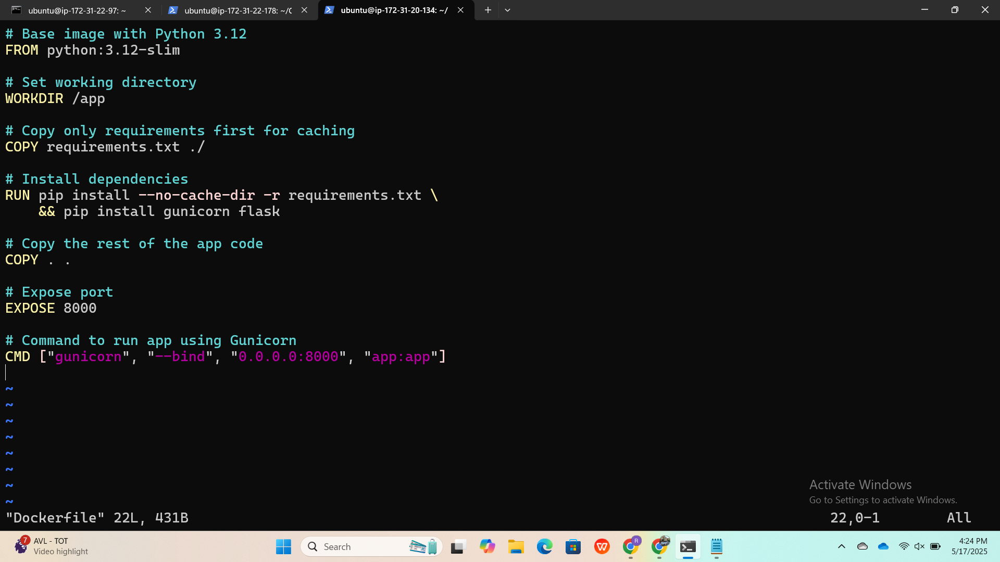

# 🐍 Flask App Deployment with Docker

This guide provides step-by-step instructions to clone, build, and deploy a Flask application using Docker.

---

## 🔧 Prerequisites

Ensure the following are installed:

- Python 3.12+
- Git
- Docker
- pip

---

## 📦 Setup Instructions

### 1. Update System and Clone Repository

```bash
sudo apt update
git clone https://github.com/CodingCraftYT/Flask-App.git
cd Flask-App
```

### 2. Create Dockerfile

```Dockerfile
# Dockerfile
FROM python:3.12-slim

WORKDIR /app

COPY requirements.txt ./
RUN pip install --no-cache-dir -r requirements.txt && pip install gunicorn flask

COPY . .

EXPOSE 8000
CMD ["gunicorn", "--bind", "0.0.0.0:8000", "app:app"]
```

---

## 🐳 Docker Commands

### Build and Run

```bash
# Allow Docker without sudo (optional)
sudo chmod 666 /var/run/docker.sock

# Build Docker image
docker build -t flask-app .

# Run Docker container
docker run -d --name flask -p 8000:8000 flask-app
```

### Check Running Container

```bash
docker ps
```

---

## ☁️ Push Image to Docker Hub

```bash
# Tag the image
docker tag flask-app rajkumar573/flask

# Login to Docker Hub
docker login

# Push the image
docker push rajkumar573/flask
```

---

## ✅ App Access

Open your browser and go to:

```
http://<your-server-ip>:8000/
```

You should see: `Hello, Flask!`

---

## 🔥 Notes

Ensure your `app.py` file contains:

```python
from flask import Flask

app = Flask(__name__)

@app.route('/')
def home():
    return "Hello, Flask!"
```

If you are using a firewall, open the port:

```bash
sudo ufw allow 8000
```


