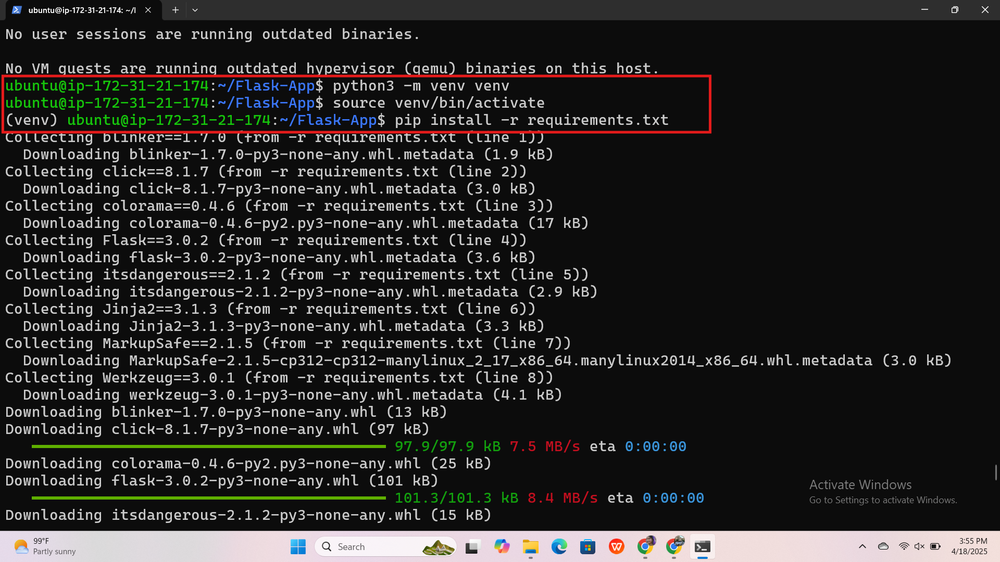

# Flask-App Setup Guide

This guide explains how to set up and run the [Flask-App](https://github.com/CodingCraftYT/Flask-App.git) using a Python virtual environment and Gunicorn.

---

## Prerequisites

- Python 3.12+
- `git`
- `pip`

---

## Setup Instructions

### 1. Update System and Clone Repository

```bash
sudo apt update
git clone https://github.com/CodingCraftYT/Flask-App.git
cd Flask-App
```

---

### 2. Install Python and venv

```bash
sudo apt install python3-pip python3.12-venv -y
```

---

### 3. Create and Activate Virtual Environment

```bash
python3 -m venv venv
source venv/bin/activate
```

---

### 4. Install Dependencies

```bash
pip install -r requirements.txt
pip install flask
```

---

### 5. Run the Flask App (Development)

```bash
python3 app.py
```

---

### 6. Install and Run Gunicorn (Production)

```bash
pip install gunicorn
gunicorn --bind 0.0.0.0:8000 app:app
```

---

## Notes

- Ensure `app.py` contains:  
  ```python
  from flask import Flask

  app = Flask(__name__)

  @app.route('/')
  def home():
      return "Hello, Flask!"
  ```

- Open firewall port (if needed):  
  ```bash
  sudo ufw allow 8000
  ```

---

## Done!

Your Flask app is now live at:  
[http://<your-server-ip>:8000](http://<your-server-ip>:8000)





