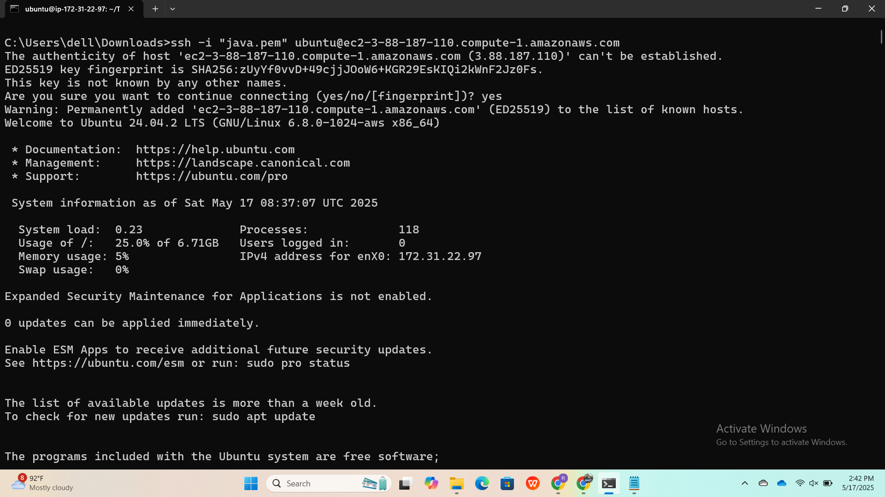
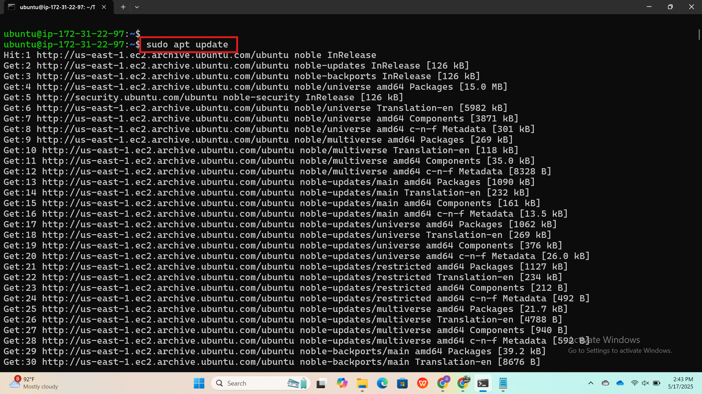
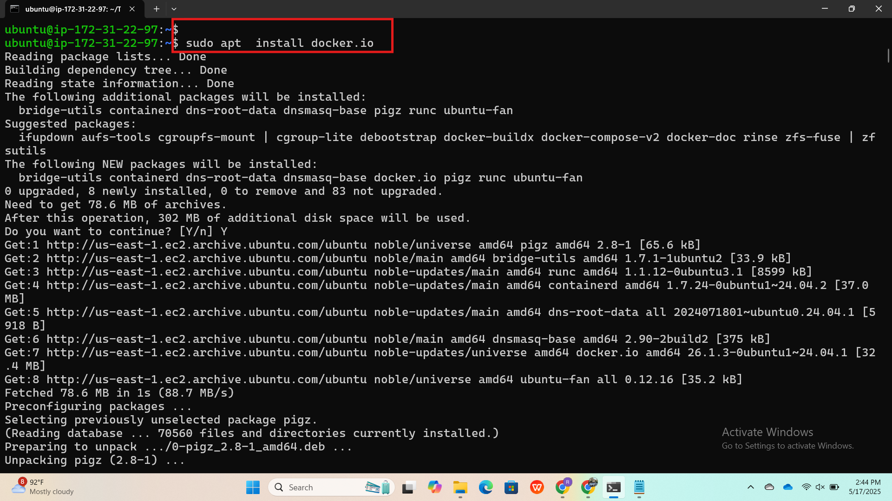
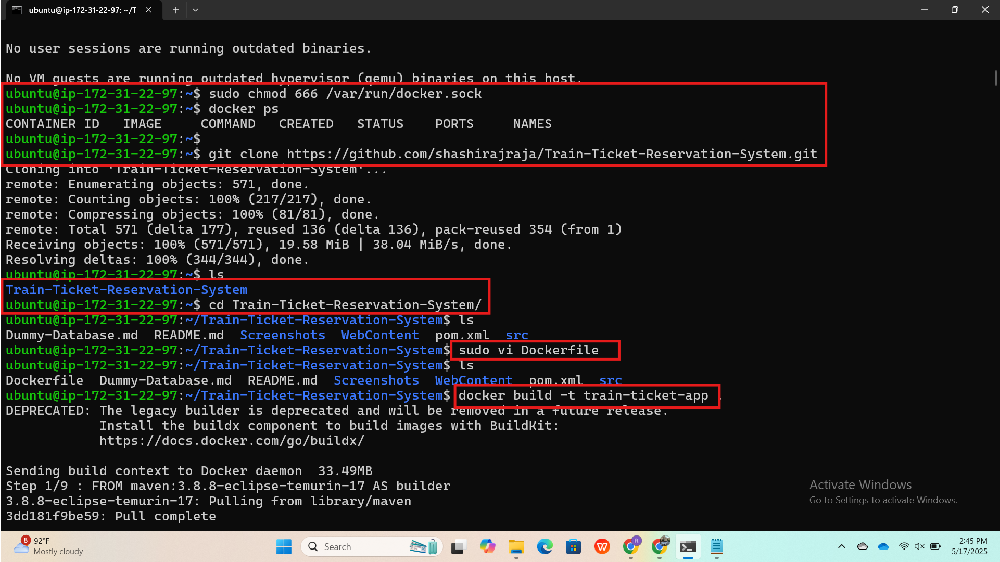
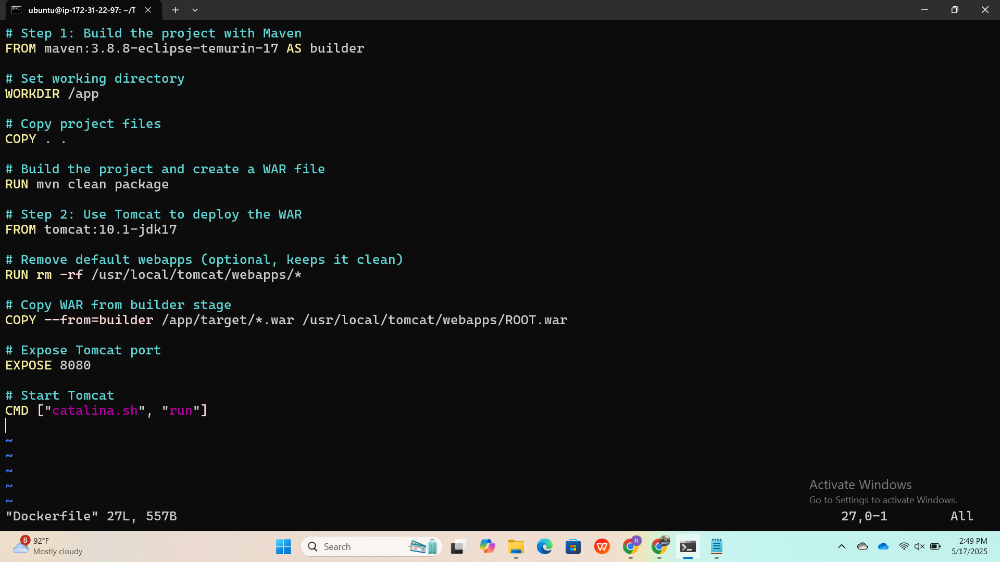
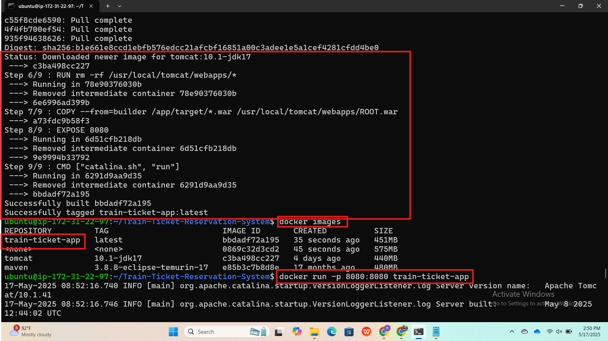
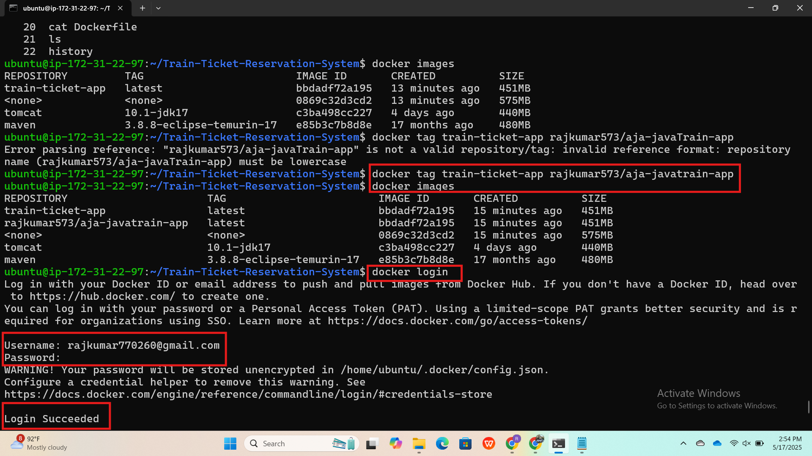
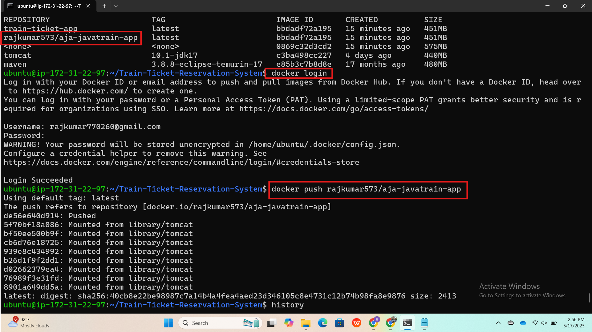
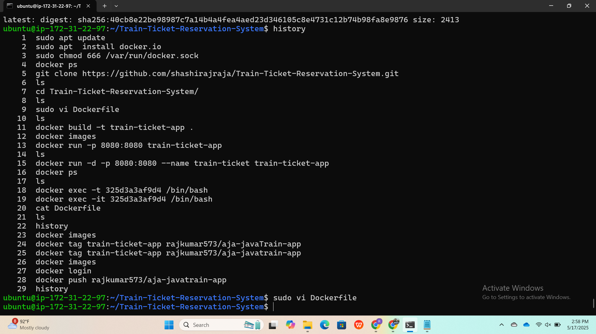

# 🚂 Train Ticket Reservation System - Docker Setup

This guide shows how to build, run, and deploy the Java Maven-based Train Ticket Reservation System with Docker and Tomcat.

---

## 🐳 Prerequisites

- Docker installed (`sudo apt install docker.io`)
- Java Maven project cloned
- DockerHub account (for image push, optional)

---

## 📁 Clone the Repository

```bash
git clone https://github.com/shashirajraja/Train-Ticket-Reservation-System.git
cd Train-Ticket-Reservation-System
```

---

## 📄 Dockerfile

Create a file named `Dockerfile` in the project root:

```Dockerfile
# Step 1: Build using Maven
FROM maven:3.8.8-eclipse-temurin-17 AS builder
WORKDIR /app
COPY . .
RUN mvn clean package

# Step 2: Deploy to Tomcat
FROM tomcat:10.1-jdk17
RUN rm -rf /usr/local/tomcat/webapps/*
COPY --from=builder /app/target/*.war /usr/local/tomcat/webapps/ROOT.war
EXPOSE 8080
CMD ["catalina.sh", "run"]
```

---

## 🧱 Build the Docker Image

```bash
docker build -t train-ticket-app .
```

---

## 🚀 Run the Container

```bash
docker run -d -p 8080:8080 --name train-ticket train-ticket-app
```

Open your browser:
```
http://<your-server-public-ip>:8080/
```

---

## 🧾 Check Logs

```bash
docker logs -f train-ticket
```

---

## 🛑 Stop & Clean Up

```bash
docker stop train-ticket
docker rm train-ticket
```










