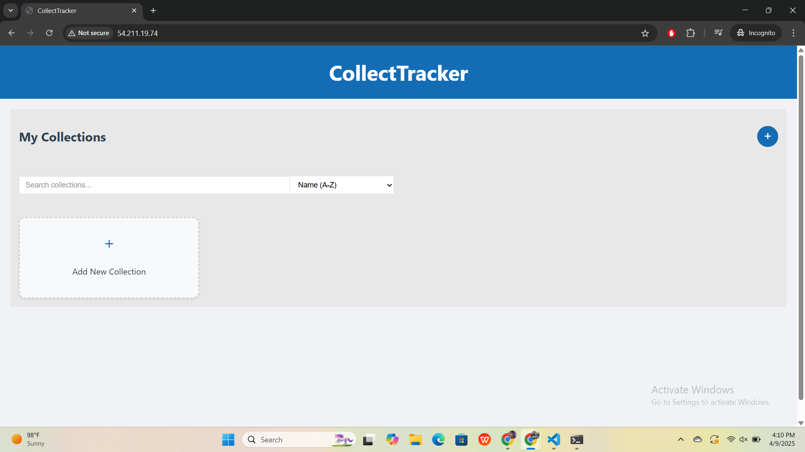

# CollectTracker Deployment Guide

This guide explains how to clone, install, build, and deploy the **CollectTracker** app on a Linux system using Node.js, npm, and Apache2.

---

## 📦 Prerequisites

Ensure your system is up-to-date and required packages are installed:

```bash
sudo apt update
sudo apt install git npm apache2

###  Clone the Repository

git clone https://github.com/Bighairymtnman/CollectTracker.git
cd CollectTracker/

### Project Structure
 client/ - Frontend (React)
server/ - Backend (Node.js)

Install Dependencies
Install root project dependencies (if any):
  npm install

Install client dependencies:
  cd client/
  npm install

Install server dependencies:
cd ../server/
npm install

 Development Mode:
  To run the server in development mode:
   
   npm run dev


Navigate to the client directory and build the React app:

cd ../client/
npm run build

This will create a build/ folder containing the production-ready frontend.


#To Deploy 
install apache2 
sudo apt install apache2
sudo systemctl start apache2 
cd /var/www/html/
sudo rm index.html  # Remove default Apache page

#Copy build artifacts to doc root folder 

sudo cp -r /home/ubuntu/CollectTracker/client/build/* /var/www/html/

#Once artifact is copied, we can test the app on the browser 



