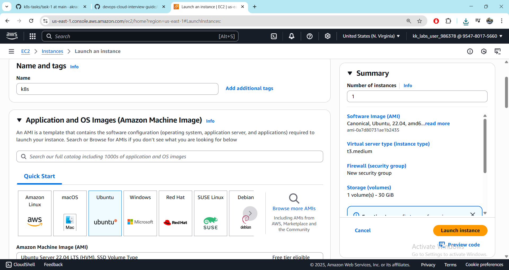
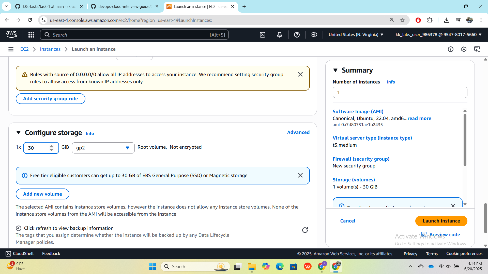
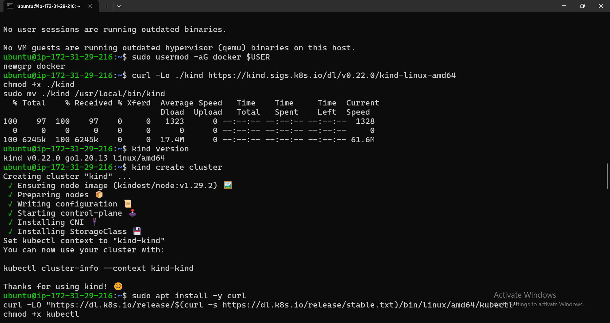
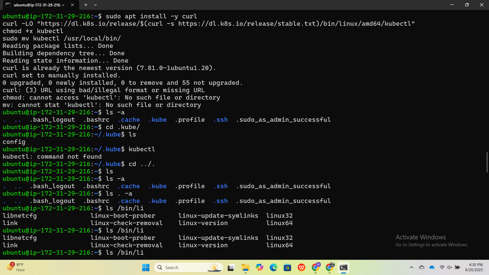
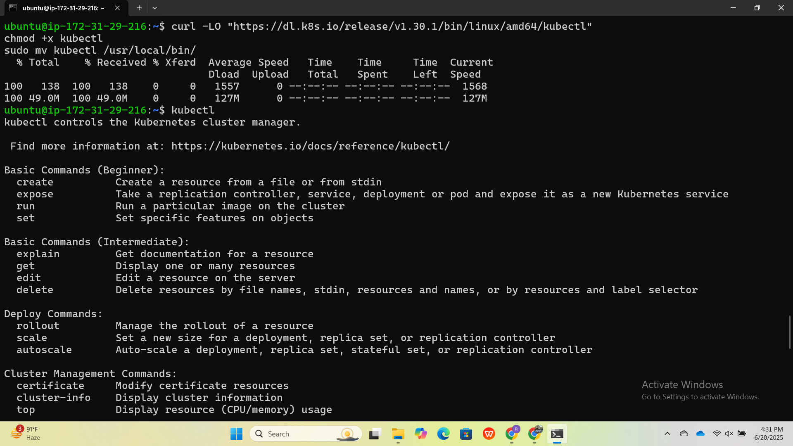
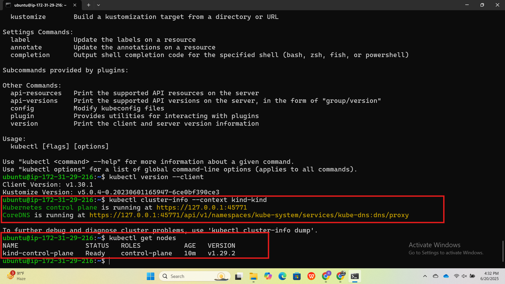
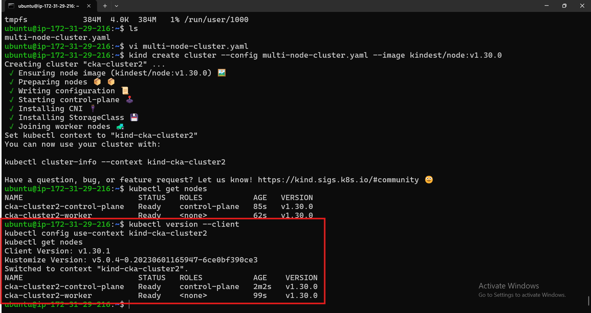
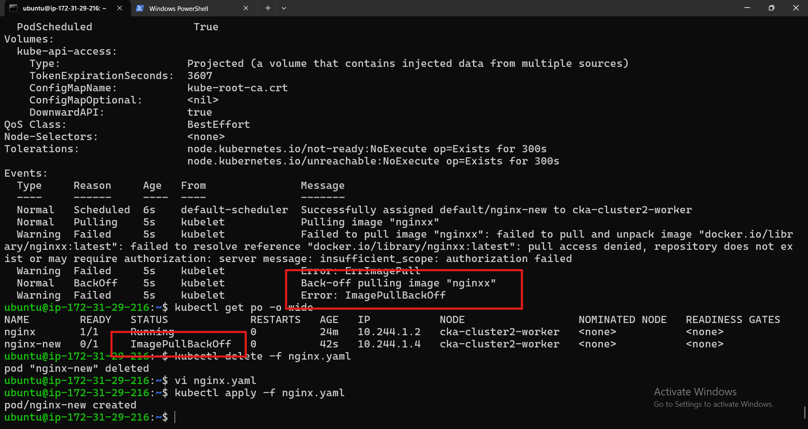
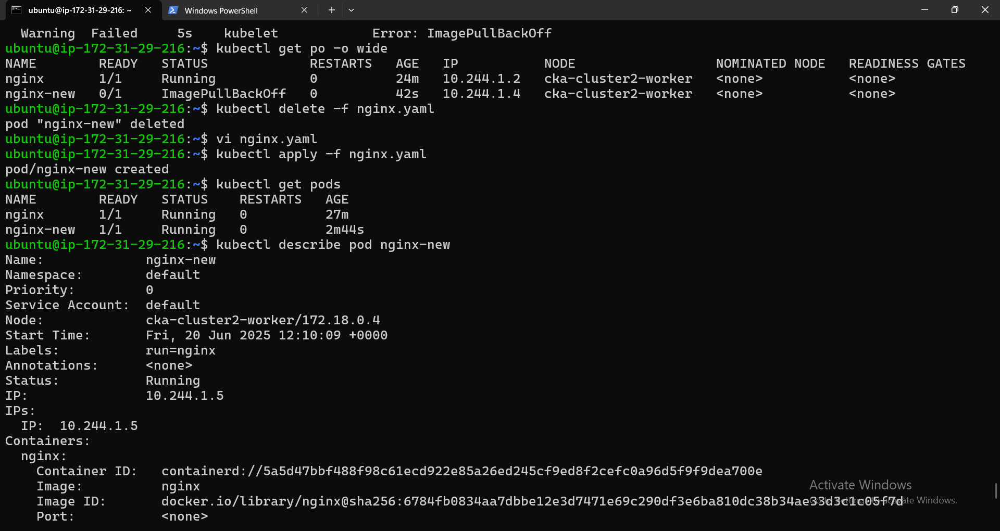
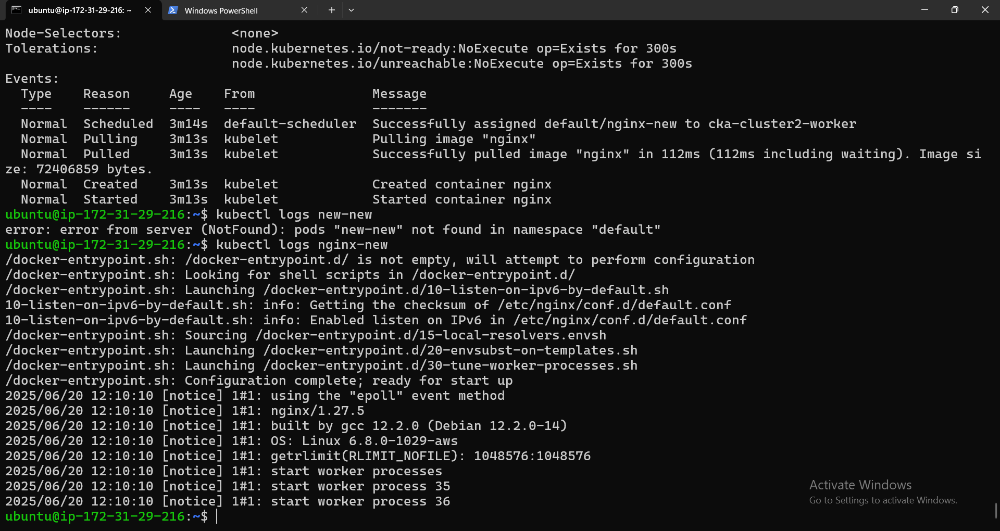

# 🧪 KIND Local Kubernetes Setup on Ubuntu

This document captures all the steps and commands used to install and run a multi-node KIND (Kubernetes IN Docker) cluster on Ubuntu.

---

## ✅ Step 1: Install KIND

```bash
curl -Lo ./kind https://kind.sigs.k8s.io/dl/v0.22.0/kind-linux-amd64
chmod +x ./kind
sudo mv ./kind /usr/local/bin/kind
kind version
```

---

## ✅ Step 2: Create a Basic Cluster

```bash
kind create cluster
```

---

## ✅ Step 3: Install kubectl

```bash
sudo apt install -y curl

# Option 1: Latest stable version (initial failed attempt)
curl -LO "https://dl.k8s.io/release/$(curl -s https://dl.k8s.io/release/stable.txt)/bin/linux/amd64/kubectl"

# Option 2: Specific version (working one)
curl -LO "https://dl.k8s.io/release/v1.30.1/bin/linux/amd64/kubectl"
chmod +x kubectl
sudo mv kubectl /usr/local/bin/
kubectl version --client
```

---

## ✅ Step 4: Explore kubeconfig

```bash
ls -a
cd .kube/
ls
cd ../.
```

---

## ✅ Step 5: KIND Multi-Node Cluster Config

Create the config file:

```yaml
# multi-node-cluster.yaml
kind: Cluster
apiVersion: kind.x-k8s.io/v1alpha4
name: cka-cluster2
nodes:
  - role: control-plane
  - role: worker
  - role: worker
  - role: worker
```

Create the cluster:

```bash
kind create cluster --config multi-node-cluster.yaml --image kindest/node:v1.30.0
```

---

## ✅ Step 6: Cluster Interaction

```bash
kubectl cluster-info --context kind-cka-cluster2
kubectl config use-context kind-cka-cluster2
kubectl get nodes
```

---

## 🧹 Step 7: Clean Up

```bash
kind delete cluster --name kind-kind
kind delete cluster --name cka-cluster2
```

---

## 📊 System Checks

```bash
free -h
nproc
df -h
docker ps
```

---

## ✅ Final Checks

```bash
kubectl get nodes
kubectl version --client
```

---

## 📝 Notes

- `v1.30.1` image was not available in Docker registry for kindest/node (use v1.30.0).
- Swap was not enabled, leading to potential memory issues.
- Minimum recommended: 4 GB RAM, 2 CPUs, 2 GB swap.

---













**Author:** Kubernetes Learner  
**Toolset:** KIND, Docker, kubectl, Ubuntu 20.04+  
