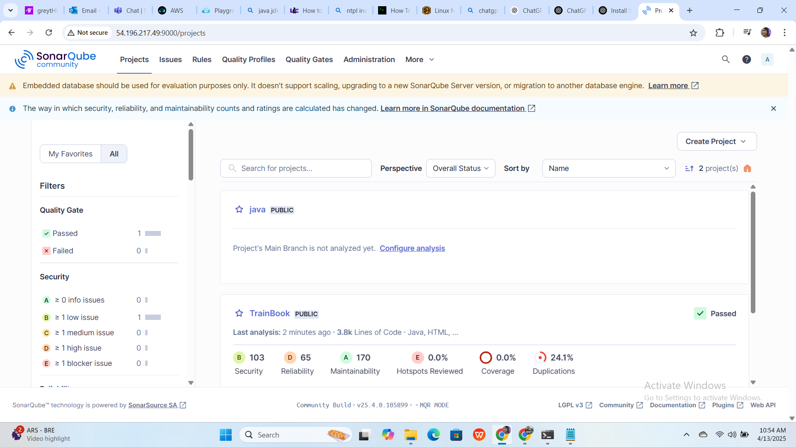

# 🚀 SonarQube Setup and Java Project Analysis (Train Ticket Reservation System)

This guide walks through installing Java, Maven, Git, SonarQube, and running a SonarQube analysis on a Java project.

---

## 🧰 1. Install Required Tools

```bash
sudo apt update
sudo apt install openjdk-17-jre-headless -y
sudo apt install maven -y
sudo apt install git -y
```

---

## 📦 2. Clone and Build the Project

```bash
# Clone the Project Repository
git clone https://github.com/shashirajraja/Train-Ticket-Reservation-System.git
cd Train-Ticket-Reservation-System

# Build the Project
mvn package
```

---

## 🚧 3. Install and Run SonarQube

```bash
# Install Java JDK (if not already done)
sudo apt install openjdk-17-jdk -y

# Download and unzip SonarQube
wget https://binaries.sonarsource.com/Distribution/sonarqube/sonarqube-25.4.0.105899.zip
unzip sonarqube-25.4.0.105899.zip

# Fix ownership so 'ubuntu' can run it (avoid using root)
sudo chown -R ubuntu:ubuntu ~/sonarqube-25.4.0.105899

# Navigate to the SonarQube executable directory
cd ~/sonarqube-25.4.0.105899/bin/linux-x86-64

# Start SonarQube
./sonar.sh start

# Check status
./sonar.sh status

# Optional: Check if SonarQube is listening on port 9000
sudo netstat -ntpl | grep 9000
```

Access the SonarQube UI at:  
`http://<your-server-ip>:9000`

- **Username:** admin  
- **Password:** admin (you’ll be prompted to change it)

---

## 📊 4. Run SonarQube Analysis on the Project

```bash
mvn sonar:sonar \
  -Dsonar.host.url=http://<your-server-ip>:9000 \
  -Dsonar.login=<your-token> \
  -Dsonar.java.binaries=target/classes
```

> Replace `<your-token>` with the one you generate from the SonarQube UI (under **My Account → Security**).

---

## 📝 Notes

- Always run SonarQube as a **non-root** user
- If SonarQube fails to start, check logs in:
  ```bash
  ~/sonarqube-25.4.0.105899/logs/sonar.log
  ```
- You can configure a **systemd service** to keep SonarQube running on reboot if needed

