# SonarQube Integration Documentation

## Overview

This document outlines the setup of **SonarQube** on **Instance One** and the configuration of a **JavaScript project** for scanning on **Instance Two**.

---

## 📍 Instance One: SonarQube Server Setup

### 1. Update Packages
```bash
sudo apt update
```

### 2. Install Java (OpenJDK 17)
```bash
sudo apt install openjdk-17-jdk
java --version
```

### 3. Download and Extract SonarQube
```bash
wget https://binaries.sonarsource.com/Distribution/sonarqube/sonarqube-25.4.0.105899.zip
unzip sonarqube-25.4.0.105899.zip
cd sonarqube-25.4.0.105899/
```

### 4. Start SonarQube Server
```bash
cd bin/
cd linux-x86-64/
./sonar.sh start
./sonar.sh status
```

---

## 📍 Instance Two: Project Setup and SonarQube Scan

### 1. Update Packages
```bash
sudo apt update
```

### 2. Clone the Project
```bash
git clone https://github.com/Bighairymtnman/CollectTracker.git
cd CollectTracker/
```

### 3. Install Node.js Dependencies
```bash
sudo apt install npm
npm install
npm -v
node -v
```

### 4. Build the Project
```bash
npm run build
```

### 5. Install Sonar Scanner
```bash
sudo npm install -g @sonar/scan
```

### 6. Configure SonarQube Project

Create a file called `sonar-project.properties` in the root of your project:

```bash
vi sonar-project.properties
```

**Add the following:**
```properties
sonar.projectKey=javascript
sonar.projectName=javascript
sonar.projectVersion=1.0
sonar.sources=.
sonar.host.url=http://34.228.143.21:9000
sonar.login=sqp_2d5612b10b4064cbd856588cabc2d09386d30597
```

> ⚠️ Replace `sonar.login` token with your actual generated token from SonarQube.

---

### 7. Run SonarQube Scan
```bash
sonar scan
```

---

## ✅ Notes
- Ensure SonarQube is up and running at the host URL.
- Open port `9000` on **Instance One**'s firewall for external access.
- You can monitor analysis results from the web interface: `http://34.228.143.21:9000`

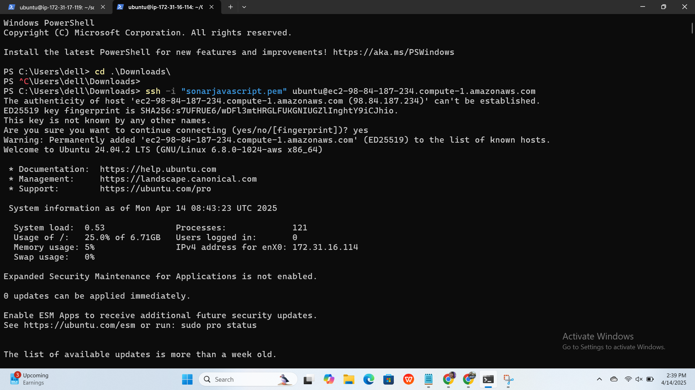
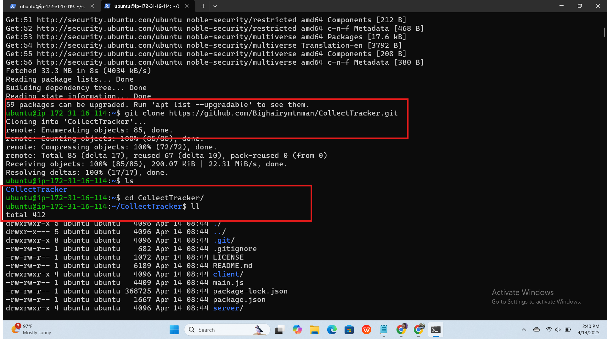
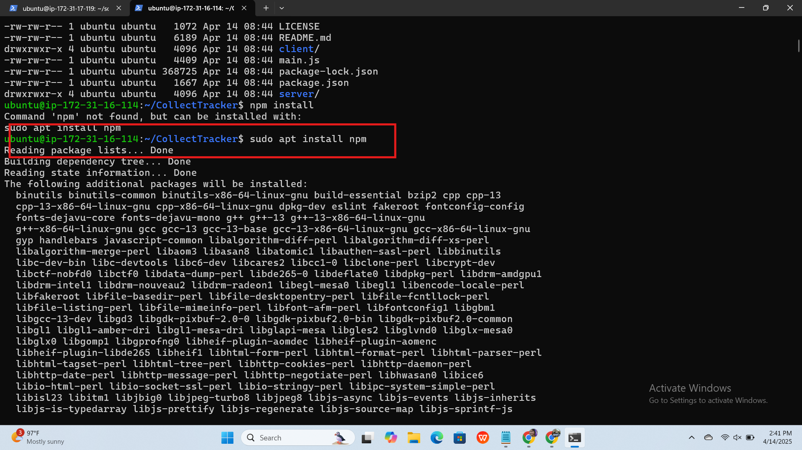
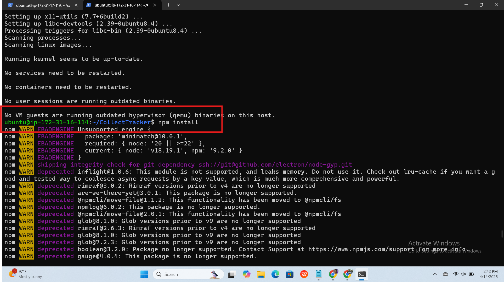
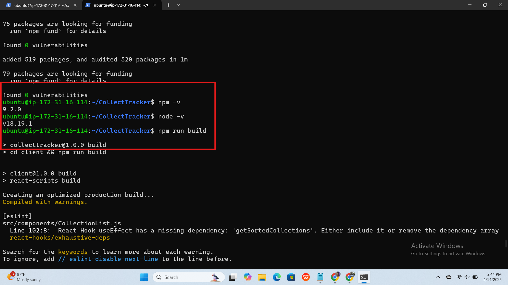
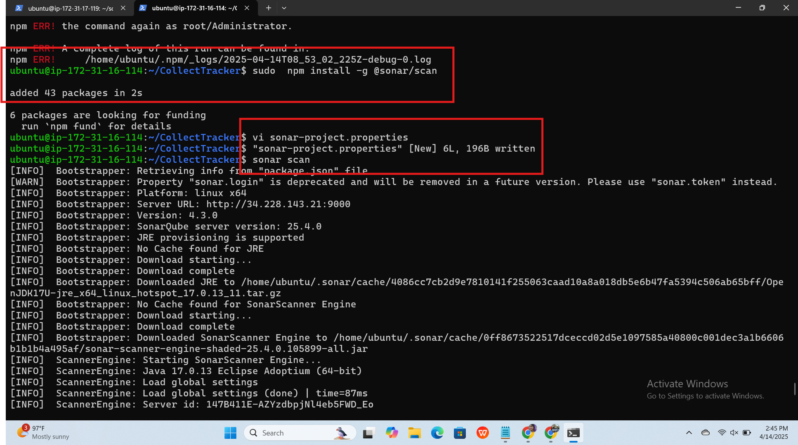
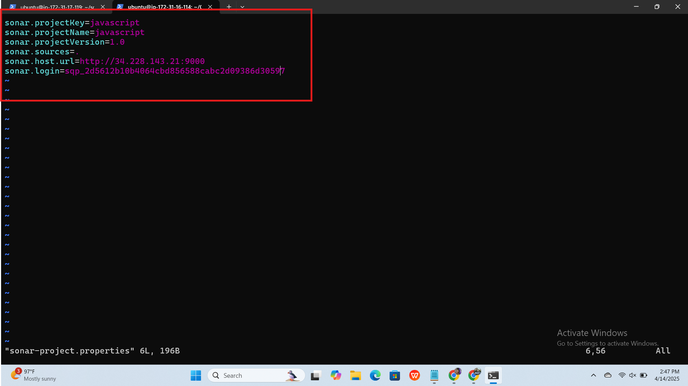
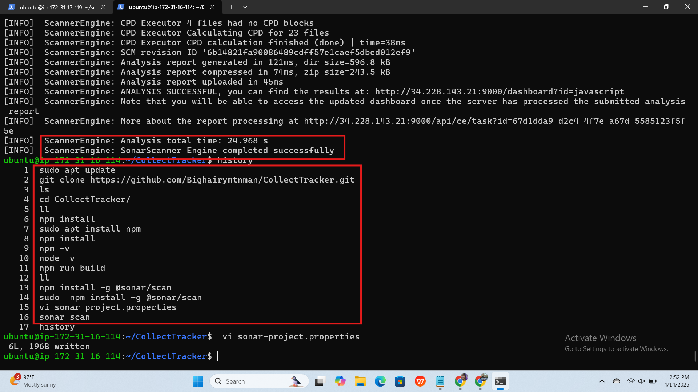
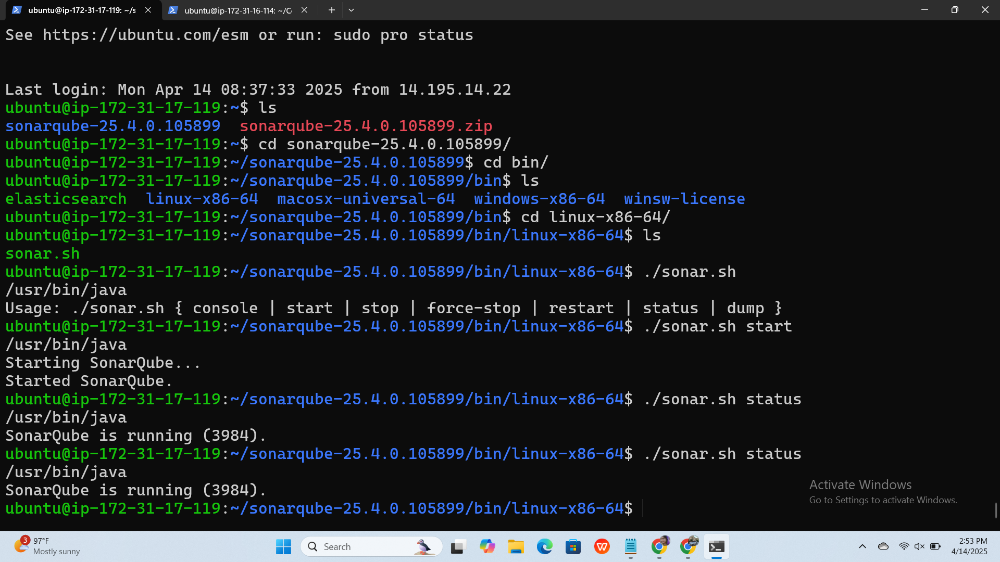
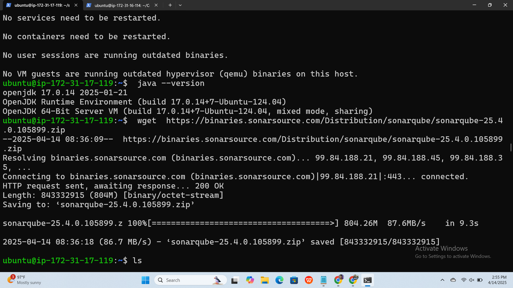
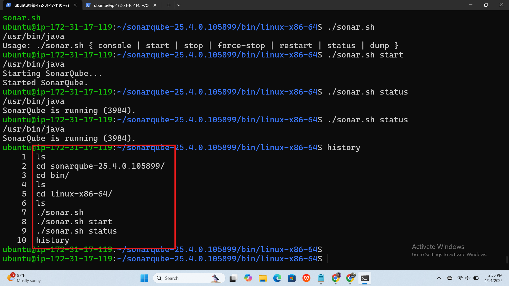
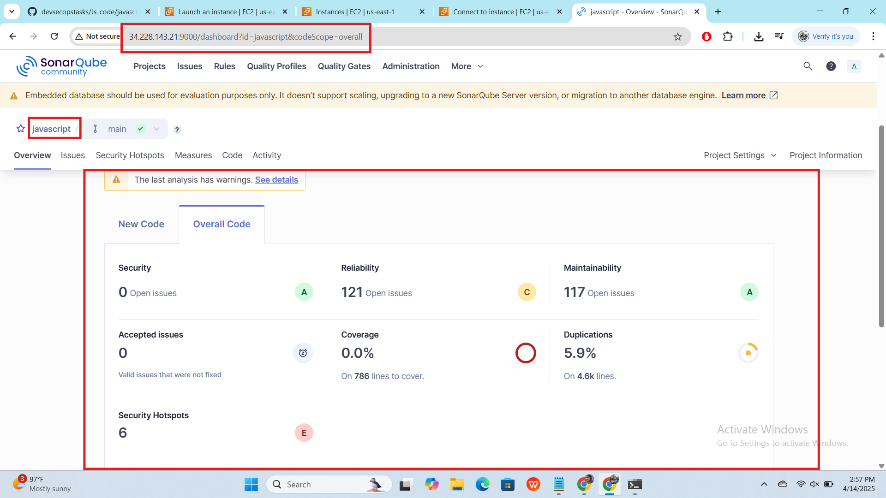

